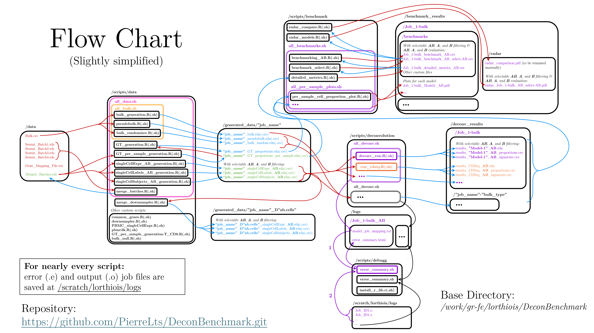
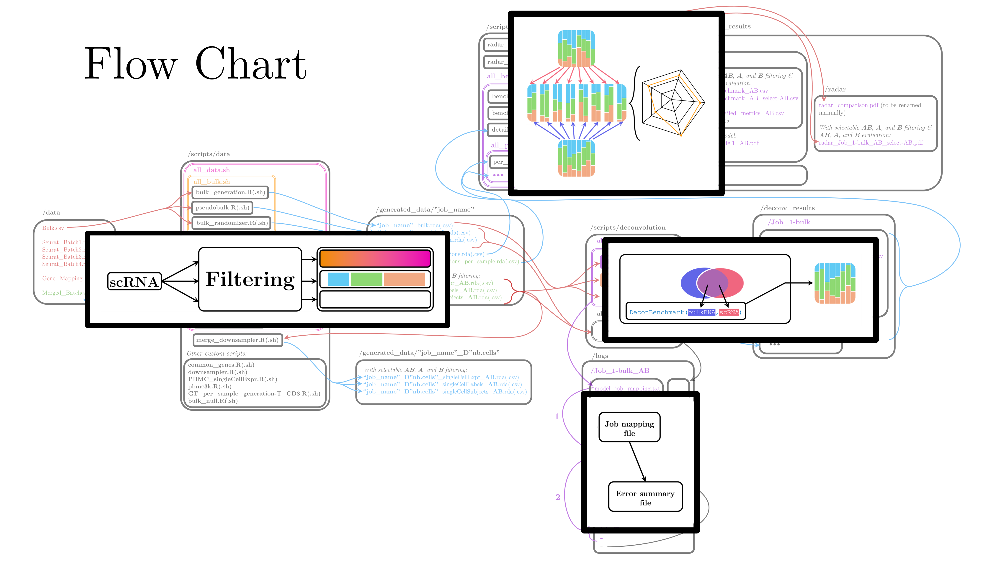

# DeconvBenchmarking pipeline
This pipeline aims at running and benchmarking deconvolution models.
The pipeline is build on the [tinnlab/DeconBenchmark](https://github.com/tinnlab/DeconBenchmark) package which unifies the running of 50 deconvolution models in one function.

Pierre Lorthiois 04/2025

## 0. Running Files
Here `.R` files should be run through their corresponding `.sh` launch scripts.

## 1. Overview
### 1.1. Installations
First intall libraries and packages running `install_r_lib.R`
### 1.2. Flow Chart
Here is a detailed flow chart of the repository to help you understand the link between files. I suggest focusing on the results you want to get or the files you want to run in a first place to keep it simple.

You can see that the project is divided in four main categories:  
Data Preparation 
Deconvolution Run 
Benchmarking 
Debugging 

## 2. Data Preparation
To run the pipeline, we first need properly formated data.
### 2.1. Data Folder
| The folder should contain: |
|-------------|------------|
| Single cell RNA-seq data: | "scRNA".rds   (our case: 4 batches "GFB...Seurat.rds") |
| Bulk RNA-seq data: | "bulkRNA".csv        (our case: "cleaned_feature_counts_matrix.csv") |
| Gene name mapping file: | mart_export.txt (Same for all of us) |

Running `merge_batches.R` will save "merged_batches.rds" which are the 4 batches of your choice merged (in our case the 4 batches "GFB...Seurat.rds")

### 2.2. Data Generation
The scripts in this section are in *scripts/data/*, and files are created at */generated_data*:
| Run `all_data.sh` to run: | |
|-------------|------------|
| **Script File** | **Output File** |
| `singleCellExpr_AB_generation.R` | "data_name"_singleCellExpr_AB.rda |
| `singleCellLabels_AB_generation.R` | "data_name"_singleCellLabels_AB.rda |
| `singleCellSubjects_AB_generation.R` | "data_name"_singleCellSubjects_AB.rda |
| | |
| `bulk_generation.R` | "data_name"_bulk.rda |
| `pseudobulk.R` | "data_name"_pseudobulk.rda |
| `bulk_randomizer.R` | "data_name"_bulk_random.rda |
| | |
| `GT_generation.R` | "data_name"_GT_proportions.rda |
| `GT_per_sample_generation.R` | "data_name"_GT_proportions_per_sample.rda |

You might want to **run it twice** because of a dependency issue: `GT_generation.R` uses /generated_data/"Job_name"_GT_per_sample.rda, generated by `GT_per_sample_genration.R`.  
.csv file versions are also saved for visualizations purpose.

Order of compilation is important for dependecies

Original .rds data found in the /data folder.
The compilable data is a .rda file composed of 2 matrices (single cell and bulk) and one vector (labels).
The section formats our .rds file into the correct format.

*Process bulk RNA-seq data*
sbatch scripts/data/`bulkRNA_generation.sh`

*Process single-cell RNA-seq data*
sbatch scripts/data/`scRNA_generation.sh`
Isolates scRNA data in a matrix and maps gene names correctly using /data/mart_export.txt

*Process cell type labels*
sbatch scripts/data/`labelsRNA_generation.sh`

*Combine all data into a single package*
sbatch scripts/data/`finalRDA_generation.sh`

*Generate ground truth cell type proportions*
sbatch scripts/data/`ground_truth.sh`
Mean ground truth cell types proportion for quick performance evaluation

*Generate per-sample ground truth proportions*
sbatch scripts/data/`per_sample_ground_truth.sh`
Ground truth cell type proportion for benchmarking

## 3. Deconvolution Run
*Run all supported methods in parallel*
sbatch scripts/deconvolution/`parallel_deconv.sh` [INPUT_RDA_FILE] [METHODS_COMMA_SEPARATED]

*Example with specific methods*
sbatch scripts/deconvolution/`parallel_deconv.sh` data/Batch1.rda "MuSic,DWLS,CIBERSORT,BayesPrism"

*Special case for CDSeq (requires separate execution)*
sbatch scripts/deconvolution/`run_cdseq.sh`

## 4. Visualization
*Generate plots comparing predicted vs. ground truth proportions*
sbatch scripts/benchmark/`per_sample_multi_plot.sh`

## 5. Debugging
*Generate error_summary.html file to ave a quick overview of errors durring deconvolution and plotting*
sbatch scripts/debugg/`error_summary.sh`
Extracts error patterns from log files found using job mapping files.

## 6. Archive
Results and script archive
